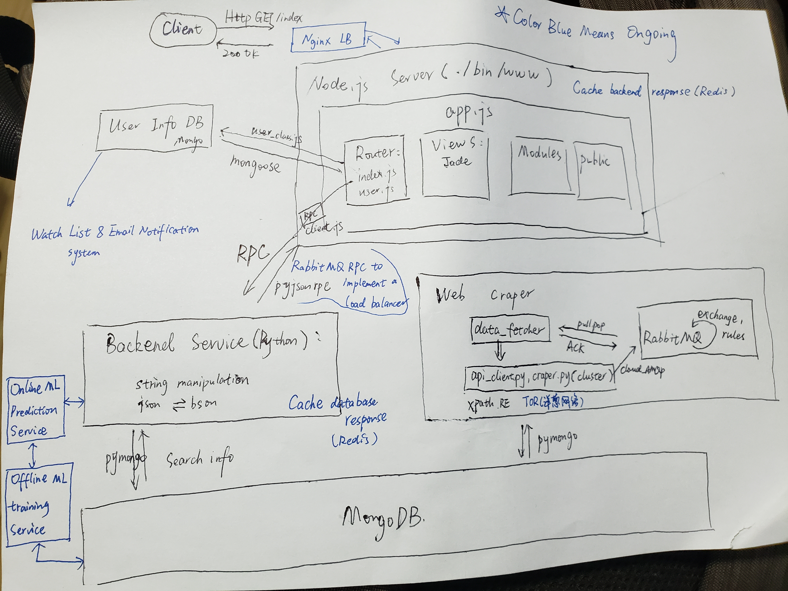

# Full_Stack_Proj

Estate Estimation by using Zillow datasets

### High Level Design:


### Next Step:



Color blue means ongoing or future optimization

### Environment:

- Windows Version `Virtual Box` : Ubuntu 16.04 LTS, 2GB Memory


### Dependencies: 

`how to install:`

- using `apt-get install`: npm , node.js mongodb

- using `npm`:  mongoose, client- sessions, password-hash, supervisor, jayson

				Express: 
				``` npm install -g express; npm install -g express-generator@4```
				
- using `pip`: xml, xmljson, request,pika(RabitMQ official recommendation), pyjsonrpc 

### Show Demo(Run)

```
	Web_server:
	supervisor ./bin/www  --- monitor
	node ./bin/www
	
	MongoDB:
	sudo service mongod start/stop/restart
	
	Backend_server:
	python server.py
	
	Web_craper:
	python data_fetcher.py

```

### Performance Test

Apache Bench

## Design:

Showed as High level design, these are details below.

### Logics between web_server:

`./bin/www` is the entrance of web_server(creating) binding with localhost `port 3000`, this server require `app.js` to get into node logical level

and this file import express framework to create a http server which leads to the listened  `req` to app.js


`app.js` set how to create a http server by using `Express` framework and `register` all kinds of `Middleware`

app.js also sets `view engine` as `Jade`

`Jade` is express framework's default view engine.


`./routes/index.js` is main direction file. 

`GET method HTTP: `

-  If url matches '/', then check if has session and show the home page

-  If url mathes '/Login', go to login page, website page render with `login.jade`

-  If url mathes '/Register', go to Register page, website page render with `Register.jade`

`POST method HTTP:`

- matches '/login', we can get `req.body.email` & `req.body.password` , then query if the user exsits and check if the password is correct by using package `password-hash` to keep password. If correct, `req.session.user = user.email`, then redirect to '/', and now req.session.user is passed to home page.

- matches '/register', check if there's the same username, if good, then create and save to db. then do the login step.

- matches '/logout', `req.session.reset()`, then redirect to home page


### Logics between Web_server and Backend_Server:

